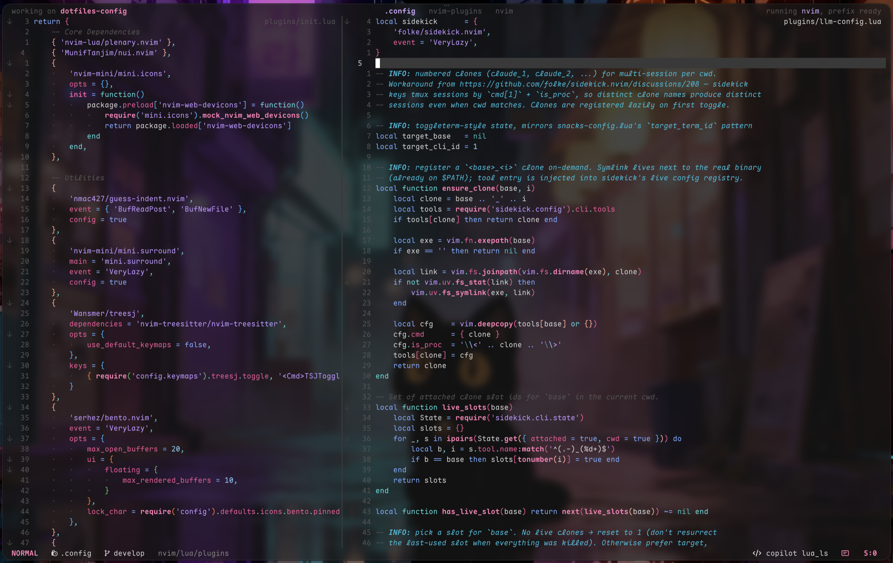

<div align="center">

<h1>MomePP's dotfiles</h1>

<p>My macOS <code>~/.config</code>, one oxocarbon theme across every tool.</p>

<p>


</p>



<p>
<a href="#install">Install</a>
&nbsp;&middot;&nbsp;
<a href="#tools">Tools</a>
&nbsp;&middot;&nbsp;
<a href="#machine-setup">Machine setup</a>
</p>

</div>

## Install

Requires [Homebrew](https://brew.sh). The repo is meant to *be* `~/.config`:

```bash
git clone https://github.com/MomePP/dotfiles-config ~/.config
~/.config/config-installer.sh
```

The installer brew-installs the CLI tools and creates the links that have to live outside `~/.config`: `~/.gitconfig`, `~/.zshrc`, `~/.zprofile`, `~/.claude/*` and `~/.local/bin/*`. It prompts before replacing anything, so run it in a terminal and don't pipe it.

<details>
<summary><code>~/.config</code> already exists</summary>

<br>

`git clone` refuses a non-empty target, so graft the repo onto it instead:

```bash
git clone --no-checkout https://github.com/MomePP/dotfiles-config /tmp/dotfiles-config
mv /tmp/dotfiles-config/.git ~/.config/.git
rm -rf /tmp/dotfiles-config
cd ~/.config && git checkout develop -- .
```

If the clone lives somewhere else (for example `~/dotfiles`), the installer copies each directory into `~/.config` instead of keeping it in place.

</details>

The installer leaves these out on purpose:

```bash
chsh -s /bin/zsh
brew trust nikitabobko/tap
brew install --cask ghostty@tip font-maple-mono-nf
brew install momepp/formulae/aerospace-swipe
git clone https://github.com/tmux-plugins/tpm ~/.config/tmux/plugins/tpm
```

## Tools

| Tool | Config | Role |
| :--- | :--- | :--- |
| [Neovim](#neovim) | [`nvim/`](nvim) | Editor |
| [Ghostty](#ghostty) | [`ghostty/`](ghostty) | Terminal |
| [tmux](#tmux) | [`tmux/`](tmux) | Multiplexer |
| [zsh](#zsh) | [`zsh/`](zsh), [`starship.toml`](starship.toml) | Shell and prompt |
| [AeroSpace](#aerospace) | [`aerospace/`](aerospace), [`aerospace-swipe/`](aerospace-swipe) | Tiling window manager |
| [Git](#git) | [`.gitconfig`](.gitconfig), [`git/`](git), [`delta/`](delta), [`lazygit/`](lazygit), [`gh-dash/`](gh-dash) | Git, diffs, TUIs |
| [CLI tools](#cli-tools) | [`bat/`](bat), [`eza/`](eza), [`homebrew/`](homebrew) | Pager, `ls`, brew taps |
| [Claude Code](#claude-code) | [`claude-code/`](claude-code) | Agent settings, hooks, skills |
| [Paseo](#paseo) | [`paseo/`](paseo), [`bin/paseo-repatch`](bin/paseo-repatch) | Agent workspace app |
| [Scripts](#scripts) | [`bin/`](bin) | Helpers, linked into `~/.local/bin` |

---

### Neovim

Neovim nightly with the [oxocarbon](https://github.com/momepp/oxocarbon.nvim) colorscheme.

- **Plugins**: [zpack.nvim](https://github.com/zuqini/zpack.nvim), bootstrapped through `vim.pack` on first launch ([`zpack-config.lua`](nvim/lua/zpack-config.lua)). Specs live in [`lua/plugins/`](nvim/lua/plugins), and revisions are pinned in [`nvim-pack-lock.json`](nvim/nvim-pack-lock.json).
- **Keymaps**: [`lua/config/keymaps.lua`](nvim/lua/config/keymaps.lua).
- **LSP**: mason + nvim-lspconfig, with per-server overrides in [`after/lsp/`](nvim/after/lsp). Completion is blink.cmp with Copilot.
- **VS Code**: [`vscode/`](nvim/vscode) holds the keymaps loaded when running under vscode-neovim.

### Ghostty

The tip build, with Maple Mono NF, 80% opacity with blur, and a hidden titlebar. ``cmd+` `` toggles the quick terminal.

- [`config`](ghostty/config): font, theme, window settings.
- [`keybinding`](ghostty/keybinding): global keys, plus CSI u for `ctrl+enter` and `shift+enter` so tmux and Neovim can tell them apart.

### tmux

The prefix is `C-a`. Plugins are managed by tpm: sensible, yank, resurrect, continuum and [agent-dock](https://github.com/MomePP/tmux-agent-dock).

| Action | Session | Window | Pane |
| :--- | :--- | :--- | :--- |
| new | `<prefix>N` | `<prefix><C-n>` | `<prefix><Enter>`, `<prefix>\|` (side by side), `<prefix>_` (stacked) |
| next | `<prefix>J`, `<prefix>L`, `<prefix>O` | `<prefix><C-j>`, `<prefix><C-o>` | `<prefix>j`, `<prefix>l`, `<prefix>o` |
| previous | `<prefix>K`, `<prefix>H` | `<prefix><C-k>` | `<prefix>k`, `<prefix>h` |
| move | | `<prefix><C-h>` / `<prefix><C-l>` (swap) | |
| kill | `<prefix>X` | `<prefix><C-x>` | `<prefix>x` |

Session keys are uppercase, window keys use Ctrl, and pane keys are lowercase.

> [!IMPORTANT]
> tpm must be at `~/.config/tmux/plugins/tpm`, the path `tmux.conf` sources, not tpm's documented `~/.tmux/plugins/tpm`. tmux ignores a failing `run` silently, so with tpm in the wrong place `<prefix>I` is simply unbound.

<details>
<summary>Missing <code>tmux-256color</code> terminfo</summary>

<br>

macOS 27 ships the entry. Only do this if `infocmp tmux-256color` fails: compile the entry with the latest ncurses ([notes](https://gist.github.com/joshuarli/247018f8617e6715e1e0b5fd2d39bb6c)).

```bash
brew install ncurses
/opt/homebrew/Cellar/ncurses/<version>/bin/infocmp tmux-256color > ~/tmux-256color.info
sudo tic -xe tmux-256color ~/tmux-256color.info
```

</details>

### zsh

The login shell is the system `/bin/zsh`. It is already in `/etc/shells`, so `chsh` needs no `sudo` and a failed `brew upgrade` can't leave the account without a shell.

| File | Holds |
| :--- | :--- |
| [`.zprofile`](zsh/.zprofile) | `brew shellenv`, PATH, exported env. Runs once per login shell. |
| [`.zshrc`](zsh/.zshrc) | Completions, prompt, vi mode, keybinds, aliases, functions. |

Both are symlinked into `$HOME`. `.zshrc` initialises starship, carapace, fnm, pyenv and bun, and sources zsh-autosuggestions and zsh-syntax-highlighting only when they are installed.

> [!NOTE]
> The `brew` function in `.zshrc` runs `claude-relink` after every call, and after `brew upgrade` also runs `paseo-repatch`, `claude-settings-sync` and `esp-clangd-update`. The claude-code cask installs to a version-stamped path, so without the relink every upgrade re-triggers macOS's "Data Access Blocked".

### AeroSpace

A tiling window manager, installed from `nikitabobko/tap`. [aerospace-swipe](https://github.com/MomePP/AerospaceSwipe) adds four-finger trackpad swipes between workspaces.

| Keys | Action |
| :--- | :--- |
| `alt-1` … `alt-8` | Go to workspace |
| `alt-shift-1` … `alt-shift-8` | Move window to workspace |
| `cmd-j` / `cmd-k` | Focus next / previous window |
| `cmd-shift-hjkl` | Focus in a direction |
| `alt-shift-hjkl` | Move window |
| `alt-minus` / `alt-equal` | Resize |
| `alt-shift-;` | Service mode: reset, float, join |

### Git

- [`.gitconfig`](.gitconfig): delta as pager, nvim as diff and merge tool, `pull.rebase`, and the gh/glab credential helpers. Symlinked to `~/.gitconfig`.
- [`git/ignore`](git/ignore): the global ignore file (XDG).
- [`delta/`](delta): the oxocarbon diff theme.
- [`lazygit/`](lazygit): delta diffs, and edits open in the surrounding Neovim.
- [`gh-dash/`](gh-dash): sections for PRs, issues and notifications.

### CLI tools

- [`bat/`](bat): the `oxocarbon-dark` theme, shared with delta. `cat` is aliased to `bat`.
- [`eza/`](eza): oxocarbon colours. `ls`, `ll`, `la` and `lt` are aliased to eza.
- [`homebrew/trust.json`](homebrew/trust.json): the third-party taps and formulae that are trusted.

### Claude Code

[`claude-code/`](claude-code) holds the global `CLAUDE.md`, the settings template, hooks, skills, and the claude-hud statusline config. The installer links them into `~/.claude/`.

> [!NOTE]
> `settings.json` is a template rather than a live mirror: Claude Code and hook-registering tools rewrite the live file. Run `claude-settings-sync` to see drift, and `--write` to port it back. See [`claude-settings-ownership.md`](.claude/knowledges/claude-settings-ownership.md).

### Paseo

Paseo runs from a patched copy, `~/Applications/Paseo-Vibrancy.app`, which [`paseo-repatch`](bin/paseo-repatch) rebuilds whenever the stock app updates. The patches add transparency, the oxocarbon ANSI colours, terminal metrics taken from the Ghostty config, and lower idle frame rates. The script's docstring documents each patch.

The Oxocarbon theme in Settings > Appearance is a plugin, [`paseo/plugins/oxocarbon`](paseo/plugins/oxocarbon), installed straight from this directory. Edit it here, then run `paseo plugin reload oxocarbon`.

<details>
<summary>Notes</summary>

<br>

- **Updates**: the `brew` wrapper re-runs `paseo-repatch` after `brew upgrade`. A beta taken through the in-app updater needs a bare `paseo-repatch` by hand.
- **Plugin theme**: Paseo derives the whole token set from eight colours, and not by name. `raised` becomes `surface1`, which fills panes and cards (in sidebar scope, the entire content pane), so it is the brightness knob, not `background`.
- **Plugin types**: run `npm install` in the plugin directory to restore the type-only devDependencies, then `npm run typecheck` to check calls against Paseo's own types.
- **Claude shows "Unavailable"** while `claude auth status` says you're logged in: delete the stale `~/.claude/.credentials.json`. Paseo reads that file before falling back to the Keychain, where Claude Code keeps the live login.
- **GPU load**: trust `sudo powermetrics --samplers gpu_power`, not `ioreg`'s "Device Utilization %". `ioreg` read 40–60% here while powermetrics showed ~92% idle.

</details>

### Scripts

The installer symlinks these into `~/.local/bin`.

| Script | Does |
| :--- | :--- |
| [`claude-relink`](bin/claude-relink) | Hardlinks `~/.local/bin/claude` to the current cask binary so the macOS privacy grant survives upgrades |
| [`claude-settings-sync`](bin/claude-settings-sync) | Reports drift between the live Claude settings and the template; `--write` ports it back |
| [`paseo-repatch`](bin/paseo-repatch) | Rebuilds the patched Paseo app |
| [`esp-clangd-update`](bin/esp-clangd-update) | Installs the latest Espressif clangd, needed for ESP32 Xtensa targets |

---

## Machine setup

These live outside the repo, so a new machine has to set them up by hand.

<details>
<summary>Touch ID for <code>sudo</code></summary>

<br>

Use `sudo_local`, which survives OS updates where editing `/etc/pam.d/sudo` does not:

```bash
sudo tee /etc/pam.d/sudo_local >/dev/null <<'EOF'
auth       sufficient     pam_tid.so
EOF
sudo chmod 444 /etc/pam.d/sudo_local
```

`pam_reattach` is not needed: tmux 3.7c keeps the audit session, so Touch ID works inside tmux. It would only matter for a tmux server first started from an SSH login.

</details>
